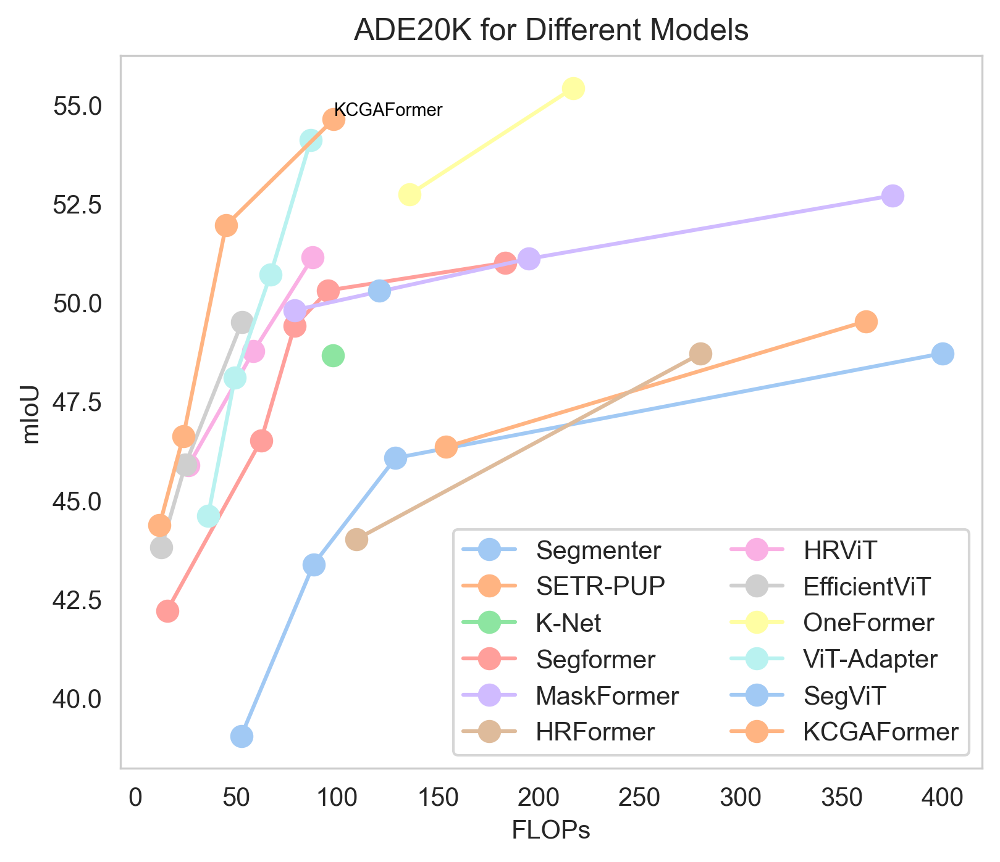
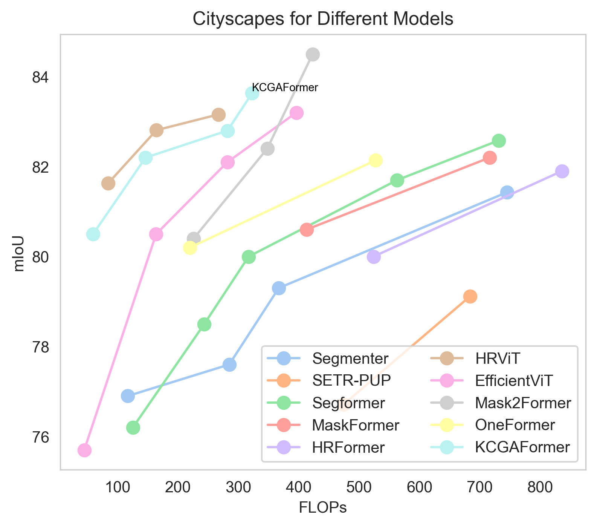
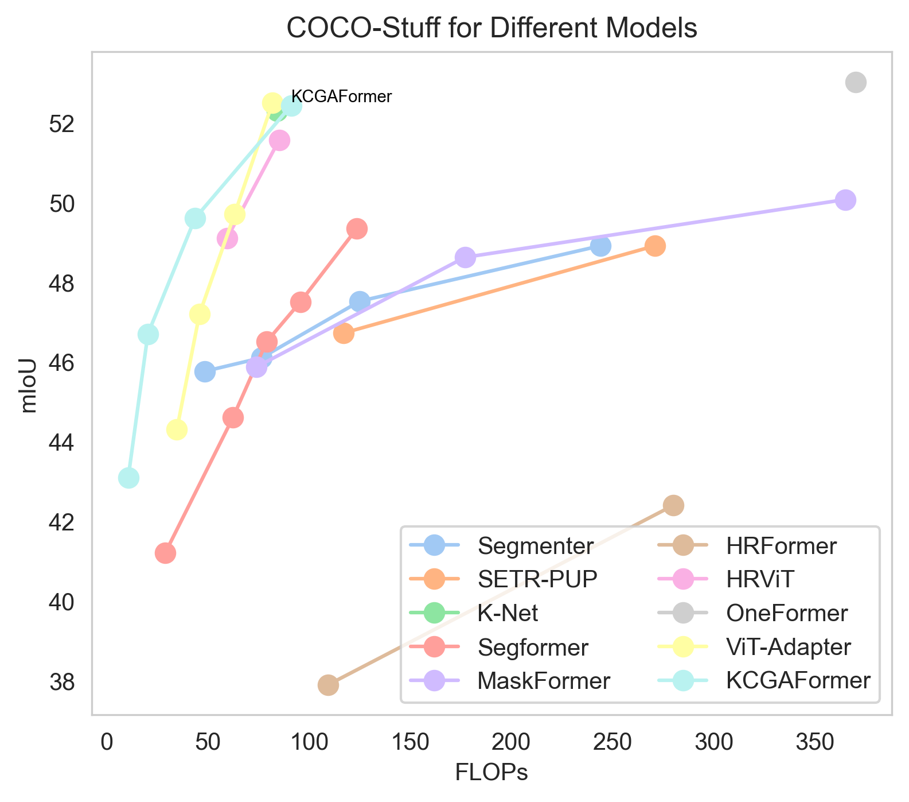

# KCGAFormer
***
<table align="center">
  <tr>
    <td style="text-align: center;">
      
    </td>
    <td style="text-align: center;">
      
    </td>
    <td style="text-align: center;">
      
    </td>
  </tr>
  <tr>
    <td style="text-align: center;">
      
ADE20K

    </td>
    <td style="text-align: center;">
      
Cityscapes

    </td>
    <td style="text-align: center;">
      
COCO-Stuff

    </td>
  </tr>
</table>

***

<table align="center">
  <tr>
    <td style="text-align: center;">
      
    </td>
    <td style="text-align: center;">
      
    </td>
  </tr>
  <tr>
    <td>
      <figcaption align="center">CAM1</figcaption>
    </td>
    <td>
      <figcaption align="center">CAM2</figcaption>
    </td>
  </tr>
</table>
